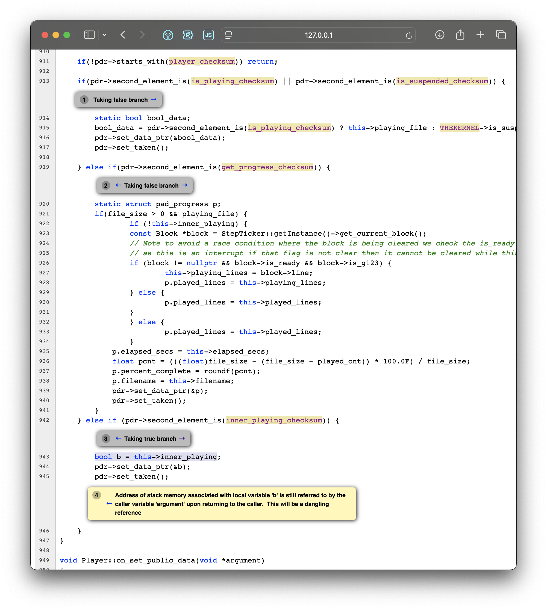

# Carvera Community Developer Docs

* [Toolchains](#toolchains)
* [Compiling the firmware](#compiling-the-firmware)
* [Flashing the firmware](#flashing-the-firmware)
  * [Carvera Controller](#carvera-controller)
  * [Carvera CLI](#carvera-cli)
  * [microSD card](#microsd-card)
* [Debugging the firmware](#debugging-the-firmware)
  * [Setup](#setup)
  * [Attaching GDB](#attaching-gdb)
  * [Controlling execution](#controlling-execution)
  * [GDB commands](#gdb-commands)
  * [Reconnecting](#reconnecting)
  * [Defining commands](#defining-commands)
* [Static analysis](#static-analysis)
  * [Requirements](#requirements)
  * [Running analysis](#running-analysis)

See also [TODO](./TODO.md) for some ideas on things to work on :)

# Toolchains

There are two GCC toolchains that have been tested with the firmware. In theory
any toolchain cross-compiling to the right ARM architecture could work.

- GCC 4.8 was the original toolchain. It's incredibly old but also the one used by upstream Makera.
- GCC 14.2 was released in December 2024 and should be preferred for new
  development. It lacks the enormous number of runtime hours accrued by normal
  users in the past. But if you're here building the firmware, you're probably
  not a normal user :)

Both toolchains can be downloaded and commands can be run using those toolchains
via the [gcc.sh](./build/gcc.sh) script.

Most of the time, this script is used by other helper scripts documented below,
rather than being called directly. However, if you find yourself in the position
of adding a new toolchain, that is the right place to do it.

# Compiling the firmware


Simply run:

```bash
# Unix
./build/build.sh

# Windows
.\build\build.ps1
```

> [!IMPORTANT]
> Windows users will need to grant permission to run PowerShell scripts:
> `Set-ExecutionPolicy -ExecutionPolicy RemoteSigned -Scope CurrentUser`

Add the `--clean` flag to build from a clean start. On a modern machine using multiple cores,
this takes all of 6-10s, meaning it's viable to always provide this flag.

The remaining arguments are passed verbatim to the make invocation. Meaning one can run:

```bash
# Unix
./build/build.sh --clean VERBOSE=1

# Windows
.\build\build.ps1 -Clean VERBOSE=1
```

A useful flag is `VERSION=string`. This sets the version string as reported by
`version` in the console. Setting this to a unique value for every build can help you
if you lose track of what you're running, for instance: 

```bash
# Unix
./build/build.sh --clean VERSION=bobby-`date +%Y-%m-%d-%H-%M-%S`
```

... will timestamp the version string in your firmware.

Additional guides related to building Smoothieware [can be found
here](https://smoothieware.github.io/Webif-pack/documentation/web/html/compiling-smoothie.html).

# Flashing the firmware

The build process will output `LPC1768/main.bin`. It should be approximately
500KB in size. There are several strategies to load this onto the machine.

## Carvera Controller

0. Copy `LP1768/main.bin` to `firmware.bin`
1. Connect to the machine (note: USB will be quite slow)
2. Select the hamburger menu (top right)
3. Choose update (up arrow)
4. Choose Firmware
5. Choose Update
6. Navigate to your local `firmware.bin`
7. Choose Upload
8. Choose Reset

## Carvera CLI

Follow instructions to [Install Carvera CLI](https://github.com/hagmonk/carvera-cli/).

```bash
uvx carvera-cli -d <ip-or-usb-port> upload-firmware --reset ./LPC1768/main.bin
```

Carvera CLI takes care of naming the file correctly and verifying its MD5. Omit
`--reset` if you'd like to reset later.

## microSD card

> [!IMPORTANT]
> Be prepared to do this if you're making significant firmware changes. Trust me!

It's strongly recommended to make a copy of your `config.txt` on the microSD
card, in case you need to format or replace the card (see below).

On C1 models:

* Although the microSD card is "reachable" without the back cover off, it can
  be very beneficial to install an microSD extension cable
* If your Mac/PC has a full sized SD card reader, there are variants that adapt
  from microSD to SD. 
* Ensure the connection is snug! I've seen errors that have turned out to be a
  loosely fitting SD extension cable.
* It's possible to insert the microSD card, miss the surface mounted slot, and
  push it into the controller board enclosure. Don't panic! Removing the four
  phillips head screws from the enclosure will allow you to retrieve it.

### Prepping the microSD card

> [!WARNING]
> USB-C cable connections will energize the controller board even when mains
> power is off! Remember to disconnect before removing or inserting the microSD card.

The most reliable process appears to be to remove `FIRMWARE.CUR` and allow the bootloader
to copy `firmware.bin` over each time.

A paranoid approach (on macOS):

```bash
md5sum LPC1768/main.bin && \
    cp LPC1768/main.bin /Volumes/SD/firmware.bin && \
    [ -f /Volumes/SD/FIRMWARE.CUR ] && \
    rm /Volumes/SD/FIRMWARE.CUR ;\
    md5sum /Volumes/SD/firmware.bin && \
    sleep 1 && \
    ls -l /Volumes/SD && \
    diskutil umount /Volumes/SD/
```

### Booting from the microSD card

0. Ensure the machine is powered down (including controller board!)
1. Insert the card.
2. Power on the machine (or energize the controller board if debugging)

After a brief moment of anxiety, the machine should wake up. The front LED (on
C1 at least) should transition from very dim green, to bright blue, then boot.

*If stuck on dim green* - the bootloader is unhappy with the firmware. This
could include having used the wrong filename, the firmware is not a valid
executable, the microSD card cannot be read, and so on.

*If stuck on bright blue but machine is dark, and stays dark* - the bootloader
jumped into your firmware, but the firmware has not entered the main event loop.
The most common cause for this will be having used the `ENABLE_DEBUG_MONITOR`
(see below) and forgotten to remove it. 

*If cycling between dim green and bright blue* - the bootloader is happy, but
the firmware is not. It is likely this will happen roughly every 10s, as that is
the default watchdog timeout after which the firmware automatically resets.
Probable cause will be a firmware crash.

# Debugging the firmware

The community firmware supports attaching GDB over a serial connection. A special debug
build is not required, although some debug specific build flags can be useful.

## Setup

As the serial port is also used for machine control, it's highly recommended to
disable the use of the serial port for this purpose, allowing GDB to stay
attached. To send commands to the machine during debugging, use the wifi
connection via Carvera Controller or Carvera CLI.

Additionally, the watchdog timer **_must be disabled_**, otherwise the device will
reboot after being trapped by the debugger.

The following flags can be set in config.txt or via the console, after which a
reboot is required.

```
# Disable the watchdog timer
config-set sd watchdog_timeout 0

# Make the serial port exclusive for GDB
config-set sd disable_serial_console true

# Optional: stop in the debugger if the machine enters a halt state
config-set sd halt_on_error_debug true
```

When making deeper modifications to the firmware, troubleshooting boot failures,
tracking memory allocations, and so on, you will want a firmware build with the
`ENABLE_DEBUG_MONITOR=1` compile time flag set. This flag traps the debugger
during [build/mbed_custom.cpp](build/mbed_custom.cpp) in `_start`, about as
early in the firmware as you can get. Not just prior to `main()`, but prior to
to C++ static constructors, SRAM region setup, etc.

> [!IMPORTANT]
> Another reminder that the USB-C connection will power the controller board.
> You can get a surprising amount of work done without turning on mains power!

Before starting work with GDB, it can be helpful to create a `.gdbinit` file that
instructs GDB to remember your command history:

```gdb
# in ~/.gdbinit
set history save on
set history filename ~/.gdb_history
set history size 10000
```

## Attaching GDB

> [!IMPORTANT] 
> Ensure that your `main.bin`, `main.elf`, and source code all line
> up exactly. Otherwise you will have a very confusing debug experience.

A script has been added to kick off GDB based on your detected toolchain.

* macOS / Linux: [mri/gdb.sh](mri/gdb.sh)
* Windows: [mri/gdb.ps1](mri/gdb.ps1)

```bash
# unix version
./mri/gdb.sh <your-serial-device>
```

If you omit the path to your serial device, the script will make an educated
guess. It's best to just give it the right path :) 

`gdb.sh` calls [gcc.sh](./build/gcc.sh) which will pull down a recent GDB if
one is not detected.

The script automatically loads [mri/init.gdb](mri/init.gdb) which contains some
helpful functions you might need while connected to the firmware. These are
discussed below.

The script will output `mri.log`, which contains a log of the read/write
communication between GDB and the device. This can be handy when verifying if
the device stopped responding.

> [!WARNING]
> Since the GCC 4.8 toolchain is old enough to go to the cinema by itself, at
> least on macOS it's not possible to use that toolchain for GDB. Thankfully,
> GDB is still GDB, and you can happily use a working GDB from a modern
> toolchain to attach.

## Controlling execution

* Hit `ctrl-c`. You will end up at whatever random instruction happened to be
  running at that moment.
* Enable the config variable `halt_on_error_debug` to stop execution on HALT.
* Add a call to `__debugbreak` in your code. Don't use this for regular
  debugging (use breakpoints), instead use this as a kind of "assert" to stop
  execution in unexpected places.
* Send `break` in the console over WiFi.

Note the debugger will also be triggered in the event of an unhandled signal
like a segmentation fault.

## GDB commands

When you run [gdb.sh](./mri/gdb.sh) or [gdb.ps1](./mri/gdb.ps1), we
automatically include [init.gdb](mri/init.gdb) whcih defines a number of useful
commands for working with the firmware.

### `reset`

Run this command to force a soft reset of the device, similar to calling "reset"
on the MDI console.

Just `ctrl-c` GDB to have it break the connection, since it will need to be
restarted. Re-run `target remote <port>`, or drop out and open the debugger
again.

### `enable-pool-trace`

This command adds breakpoints to predefined symbols inside alloc and dealloc
functions in [src/libs/MemoryPool.cpp](src/libs/MemoryPool.cpp). MemoryPool is a
single contiguous area allocator that manages most of the SRAM region. SRAM is
limited to 32K and is the lowest latency memory available on the LP1768. 

Most modules are placed in dynamically allocated chunks in this region, while a
handful of others (SD filesystem related) are statically placed there at compile
time. Certain modules will continue to make calls to MemoryPool during their
runtime.

This GDB command is primarily useful with `ENABLE_DEBUG_MONITOR=1` because most
activity happens during kernel and module initialization, and by capturing these
logs from firmware boot it's possible to have a complete picture in the case of
a post-initialization crash.

After running this command, execute `continue`. Both alloc and dealloc
breakpoints will output the pointer in question as well as its size. A backtrace
is also logged to identify call sites. This should be enough data to catch
pointer reuse, over-frees, pool exhaustion, and so on.

### `smoothie-full-dump` and `smoothie-mini-dump`

Borrowed from [Smoothieware](http://smoothieware.org/mri-debugging) these
commands dump a variety of program state. 

Especially in the case of the full dump, it's advisable to capture the output to
a file:

```gdb
set logging file <some file>
```

To avoid flooding the console, you can redirect all output to a file. Remember
to disable this afterwards:

```gdb
set logging redirect on
```

### `hardfault-break` and `fault-info`

`hardfault-break` plants a breakpoint on the MCU's `HardFault_Handler`.  
Leave it enabled and any CPU fault (bus/usage/memory) will pause execution the
instant it occurs, letting you inspect the exact crashing instruction.

`fault-info` prints the four System Control Block registers the Cortex-M3
records after a fault (`HFSR`, `CFSR`, `BFAR`, `MMFAR`).  
Refer to the LPC176x User Manual (chapter 32) or ARM "Cortex-M3 Devices Generic
User Guide" (section 4.3) for the meaning of each bit or address.

Together these commands tell you whether a reset was triggered by your firmware
(null pointer, invalid memory write, stack overflow, etc.) or something more
serious such as corrupted memory that could point to hardware issues.

Why not simply let GDB 'catch' the crash? On bare‑metal Cortex‑M parts there is
no OS to raise a UNIX‑style segmentation fault.  Unless you set this breakpoint
the CPU will dive into HardFault_Handler, trash the original register state,
print a message, and usually reset before the debugger ever sees the real
failure.  hardfault‑break stops execution **at the exact vector entry**,
preserving the stacked PC/LR so you can see where things truly went wrong.

## Reconnecting

When the firmware restarts, you'll lose your GDB connection. Rather than
restarting GDB, you can run:

```gdb
target remote <your serial dev>
```

However it's often good practice to start a fresh GDB session, which is less
painful once you have GDB command history setup as described above.

## Defining commands

Without turning this into a full guide on GDB, it's worth noting that you will
rapidly find a need for aliasing common commands and running pre-canned routines
repeatedly.

These can be placed in your `~/.gdbinit` or loaded from a file in GDB with
`source`. The aforementioned [mri/init.gdb](mri/init.gdb) functions are loaded
for you and function similarly.

```gdb
# alias commands
alias -a binit = "break main.cpp:init"

# define a command
define dumpmem
  echo --- Memory Pool Dump ---\n
  p _AHB0
  p _AHB1
end

# run a command every time you run 'next'
define hook-next
    dumpmem
end

# run commands when a breakpoint is hit
break MemoryPool::alloc if nbytes >= 5000
commands
  printf "--- Large AHB Pool Allocation (%lu bytes) ---\n", nbytes
  printf "Call Stack:\n"
  bt
  printf "--------------------------------------------\n"
  cont
end
```

# Static analysis



Static analysis examines source code for potential defects without actually
executing it. It's particularly effective at finding issues like potential null
pointer dereferences, resource leaks (memory, file handles), uninitialized
variables, unreachable code, and deviations from coding standards. For embedded
systems like this firmware, static analysis is invaluable as it can catch subtle
bugs early in the development cycle, improving reliability and reducing the need
for extensive hardware debugging. We leverage Clang's powerful static analyzer
(via `analyze-build`) for this purpose, despite the project being built with
GCC.

Further reading: [a walkthrough of using clang's static analysis tools in a GCC repo](https://interrupt.memfault.com/blog/static-analysis-with-codechecker)


## Requirements

* **Clang Toolchain**: A full installation of Clang/LLVM is required,
  specifically including the `analyze-build` and `scan-view` tools. Note that
  the default Xcode command-line tools on macOS may not include these; a
  separate installation (e.g., via Homebrew `brew install llvm`) might be
  necessary.
* **Bear**: Since our build process uses Make and GCC, we need a way to capture
  the compilation commands in a format Clang understands
  (`compile_commands.json`). [Bear](https://github.com/rizsotto/Bear) intercepts
  the build process to generate this file.


> [!IMPORTANT] 
> on macOS, `bear` seems very picky about compiler paths. I used the homebrew version and 
> had to edit its "wrapper.d" directory to add tool names as follows:
> ```
> ls -l /opt/homebrew/Cellar/bear/3.1.6/lib/bear/wrapper.d/ | grep -i arm
> lrwxr-xr-x@ 1 lburton  admin  10 Apr 19 17:27 arm-none-eabi-ar -> ../wrapper
> lrwxr-xr-x@ 1 lburton  admin  10 Apr 19 17:26 arm-none-eabi-g++ -> ../wrapper
> lrwxr-xr-x@ 1 lburton  admin  10 Apr 19 17:27 arm-none-eabi-gcc -> ../wrapper
> ```

## Running analysis

The high-level process involves using `bear` to create a `compile_commands.json`
file from our standard GCC build, and then feeding this file to Clang's
`analyze-build` tool. Finally, `scan-view` provides a convenient web-based UI to
browse the results.

**Clean first.** Start with a clean slate to ensure all files are analyzed.
```bash
make clean
```

**Generate `bear.json`.** This file allows `bear` to munge the intercepted compiler
commands from GCC-speak to Clang-speak. Your GCC toolchain needs to be in your
`PATH` for this to work.

```bash
python3 ./build/generate_bear_json.py
```

**Intercept Build with Bear.** Runs the normal build process but `bear` captures
what is going on.

Note: `--force-wrapper` may or may not be required on your machine. If not on
macOS, change the `-j` argument to however many cores you have.

```bash
# macOS example
bear intercept --force-wrapper -- make -j$(sysctl -n hw.ncpu) AXIS=5 PAXIS=3 CNC=1 all
```

Note: If analysis fails for certain files, the `bear.json` configuration is the
most likely place to adjust flags. The `--verbose` flag during next step can
provide helpful debugging information. 

Generate `compile_commands.json`. Processes the intercepted data (`events.json`)
using `bear citnames` and the `bear.json` config to create the final
`compile_commands.json` file that `analyze-build` understands. At last.

```bash
bear citnames --verbose --run-checks --config build/bear.json
```

**Run Clang Static Analyzer.** `analyze-build` finds `compile_commands.json` in the
current directory. 

We disable the `core.FixedAddressDereference` checker as direct memory-mapped
register access is common and necessary in embedded development, leading to
numerous false positives with this check. See the [Clang Static Analyzer
Checkers list](https://clang.llvm.org/docs/analyzer/checkers.html) for more
information on available checks.

```bash
rm -rf .analyzer && analyze-build -o .analyzer --disable-checker core.FixedAddressDereference
```

**View the results.** Launch the `scan-view` tool, pointing it to the output
directory created by `analyze-build`.

```bash
python3 $(which scan-view) .analyzer/*
```


